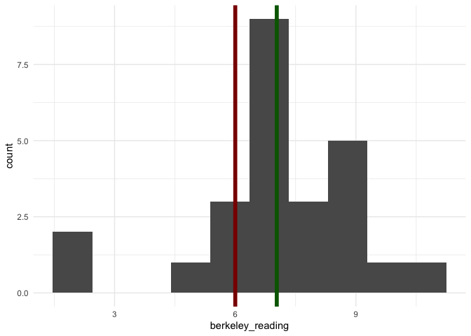

6.18 Concept Check
================
D. Alex Hughes
2023-02-10

``` r
library(ggplot2)
theme_set(theme_minimal())

set.seed(2)
```

You want to test whether Berkeley students read more or less than the
national average of 6 hours per week. You measure a random sample of 25
Berkeley students and find that this group has a sample average of 7.0
hours and a sample standard deviation of 2.0 hours.

``` r
berkeley_reading <- c(
  6.5,  8.8, 11.1,  9.2,  8.0,  
  9.6,  2.4,  6.7,  6.4,  8.4,
  6.7,  7.6,  7.1,  6.2,  6.4,  
  6.5,  6.0,  7.5,  8.9,  6.8,
  2.3,  7.3,  5.7,  8.5,  5.2
)
```

# Question 1

With a sample of 25, what do you know about the central limit theorem?

1.  The central limit theorem definitely does **not** apply, and there
    is no reason to anticipate that the sample averages (in this case,
    we have one realization of 7.0) should be distributed approximately
    normal.
2.  The central limit theorem definitely **does** apply, and there is a
    virtual guarantee that the sample averages (in this case, we have
    one realization of 7.0) should be distributed approximately normal.
3.  It depends. Depending on the nature of the underlying distribution,
    the central limit theorem **might** or **might not** generate sample
    averages (in this case, we have on realization of 7.0).

# Question 2

Suppose that you are curious whether the distribution of hours read
among Berkeley students is different from zero. This is a two sided
question.

1.  State the null hypothesis, and alternative hypothesis that you are
    testing.
2.  State a rejection criteria, generated by the data, that would lead
    you to reject this null hypothesis. (This could be a value for a
    test-statistic, or a p-value.)
3.  Conduct a t-test, using the R built in function called `t.test`, and
    compare the rejection criteria that you stated against the value
    generated by the data. What do you conclude vis-a-vis your null
    hypothesis?

``` r
t.test(berkeley_reading)
```

    ## 
    ##  One Sample t-test
    ## 
    ## data:  berkeley_reading
    ## t = 17.918, df = 24, p-value = 2.137e-15
    ## alternative hypothesis: true mean is not equal to 0
    ## 95 percent confidence interval:
    ##  6.222005 7.841995
    ## sample estimates:
    ## mean of x 
    ##     7.032

# Question 3

You were recently reading the paper, and they claimed that population
expectation for the number of hours read is 6. (How did the paper get
access to the PDF that describes the number of hours read is part of the
fantasy of this question.)

You are interested in knowing whether the sample average that you have
generated is different from six. This is a two-sided question.

As a starting place, produce a histogram of the data and include a
vertical line with your null hypothesis:

``` r
ggplot() + 
  aes(x=berkeley_reading) + 
  geom_histogram(bins=10) + 
  geom_vline(xintercept=6, color='darkred', linewidth=2) + 
  geom_vline(xintercept=mean(berkeley_reading), color='darkgreen', linewidth=2)
```

<!-- -->

## 3.1 Do you think the test is going to reject

Given what you are seeing here, do you think that the test that you’re
going to conduct in the next part is going to reject the null?

## 3.2 Conduct the test

Now, let’s actually do the testing!

1.  State the null hypothesis, and alternative hypothesis that you are
    testing.

> ‘Actually take the time to write it here. We are going to come back to
> this in a moment.’

2.  State a rejection criteria, generated by the data, that would lead
    you to reject this null hypothesis. (This could be a value for a
    test-statistic, or a p-value.)
3.  Conduct a t-test, using the R built in function called `t.test`, and
    compare the rejection criteria that you stated against the value
    generated by the data. What do you conclude vis-a-vis your null
    hypothesis?

In order to conduct this test, you may have to read the function
documentation, because you are going to have to decide how to run the
test against the null hypothesis that you have stated above. In the code
below, we have commented (by placing a \# at the beginning of the line)
a command that you can use to access the documentation for a t-test. If
you remove this comment character, then issue the line, it will pull up
the documentation. This method applies generally, across all functions.

``` r
test_result <- t.test(berkeley_reading, mu = 6)
test_result
```

    ## 
    ##  One Sample t-test
    ## 
    ## data:  berkeley_reading
    ## t = 2.6296, df = 24, p-value = 0.01469
    ## alternative hypothesis: true mean is not equal to 6
    ## 95 percent confidence interval:
    ##  6.222005 7.841995
    ## sample estimates:
    ## mean of x 
    ##     7.032

What do you conclude?

## 3.3 Are you surprised?

Are you at all surprised at the conclusions from the test, compared to
what you obseved in the histogram? (To be totally transparent, the
histogram is a tiny bit of a red-herring).

Look back to the null hypothesis that you stated. Did your null
hypothesis make **very** clear that you were considering *sample
averages*?

**STOP HERE FOR CONCEPT CHECK 6.18.**

After you read about p-values, we will have you come back to this
worksheet to work on the following coding exercise.

# 4. How does a p-value work?

When we conducted the t-test against the data, we used the formula:

$$
t = \frac{\overline{X} - H_{0}}{\widehat{\sigma}/\sqrt{n}} \text{, where}
$$

- $\overline{X}$ is the sample average, which we compute using
  `mean(berkeley_reading)`;
- $H_{0}$ is the null hypothesis, i.e. that the population expectation
  is 6;
- $\widehat{\sigma}$ is the estimated sample standard deviation, which
  we compute using `sd(berkeley_reading)`; and,
- $\sqrt{n}$ is the square root of the sample, size, which we compute
  using `sqrt(berkeley_reading)`.

You could compute this test statistic value by writing a function that
takes in data, and computes each of these quantites:

``` r
t_test <- function(data, null) { 
  (mean(data) - null) / (sd(data)/sqrt(length(data)))
}

t_test(data=berkeley_reading, null=6)
```

    ## [1] 2.629575

Notice that this matches with the statistic value supplied after using
the built-in method:

``` r
test_result$statistic
```

    ##        t 
    ## 2.629575

A useful working definition, provided by Larry Wasserman in *All of
Statistics* (p. 158) is:

> The p-value is the probability (under $H_{0}$) of observing a value of
> the test statistic the same as, or more extreme than what was actually
> observed.

Unpacking that definition somewhat further:

- *The p-value is the probability*: We have a working, frequentist
  definition of probability: the fraction of times that an event occurs
  out of the total collective ouf outcomes. This idea is immediately
  useful when we think about a simulation.
- *(under $H_{0}$) of observing a value of the test statistic*: We just
  wrote a function that produces test statistics, we just need to think
  about what “under $H_{0}$” means. This is like, “If the null
  hypothesis were *actually* true,”
- *As, or more extreme than what was actually observed.*: This is a
  simple statement that sets up a comparison: “more extreme than
  observed”.

What if you could generate data according to the null hypothesis,
compute a test statistic, and store that value? It turns out, we can!

``` r
simulated_data <- rnorm(n=25, mean=6, sd=sd(berkeley_reading))
simulated_data
```

    ##  [1]  4.239989  6.362729  9.115820  3.781870  5.842522  6.259848  7.389216
    ##  [8]  5.529642  9.894122  5.727659  6.819554  7.926488  5.229416  3.959863
    ## [15]  9.497258  1.465002  7.724081  6.070263  7.987468  6.848232 10.102803
    ## [22]  3.645392  9.119338  9.835602  6.009689

Notice that to produce this “null hypothesis data” we needed to use an
*estimated value* for the standard deviation.

We can move from data to a test statistic:

``` r
t_test(data=simulated_data, null=6)
```

    ## [1] 1.459322

And, we could do this many times, using the random number generator
within R to produce new samples *from the population implied by the null
hypothesis* each time.

``` r
simulation_results <- NA 

for(i in 1:100000) { 
  simulated_data        <- rnorm(n=25, mean=6, sd=sd(berkeley_reading))
  simulation_results[i] <- t_test(simulated_data, null=6) 
  }
```

Notice in the for-loop above, `simulated_data` is not indexed in `i`,
but `results` *is*. This means that the loop is going to:

1.  Start loop iteration \#1.
2.  Produce a sample.
3.  Compute a test statistic, and store it in the **first** slot of
    `results`.
4.  Return to the top of the loop, for iteration \#2.
5.  Produce a sample.
6.  Compute a test statistic, and store it in the **second** slot of
    `results`.
7.  Return to the top of the loop, for iteration \#3…

*What is the upshot of this?*

At the end of the simulation, we have simluated a set of data that fits
with the second part of the definition of a p-value. Below, we’ll print
the first 10 of these test statistics “under the null”

``` r
simulation_results[1:10]
```

    ##  [1] -0.91242644 -0.33105113 -0.73657410  1.77787638  0.07456023  0.31344163
    ##  [7] -1.83478020  1.16090688  0.53941860 -0.55475538

We can compare each of these to see if they are **more extreme** than
the statistic that we actually observed with our `berkeley_reading`
data. To accomplish “more extreme” we will use the absolute value to
make everything positive, and a greater than binary comparison. Once
again, we will print only the first 10 results.

``` r
(abs(simulation_results) > test_result$statistic)[1:10]
```

    ##  [1] FALSE FALSE FALSE FALSE FALSE FALSE FALSE FALSE FALSE FALSE

And, finally, to accomplish the first task, to produce a statement of
probability, we can simple compute the proportion of this vector.
Because this produces a single value, we will show the value.

Before we run that line: recall the definition of a p-value.

> The p-value is the probability (under $H_{0}$) of observing a value of
> the test statistic the same as, or more extreme than what was actually
> observed.

In the code chunk below, we can quite literally read that what we have
written comports with this definition:

1.  `mean` is the probability in terms of frequency;
2.  `simulation_results` are generated data under the null; and,
3.  `> test_result$statistic` is the “…more extreme than was actually
    observed.”

``` r
simulation_p_value <- mean(abs(simulation_results) > test_result$statistic)
simulation_p_value
```

    ## [1] 0.01507

## Big Conclusion

Compare the value returned in the previous chunk to the p-value that we
returned, at the very beginning, when we inspected the entire
`test_result` object.

``` r
simulation_p_value
```

    ## [1] 0.01507

``` r
test_result
```

    ## 
    ##  One Sample t-test
    ## 
    ## data:  berkeley_reading
    ## t = 2.6296, df = 24, p-value = 0.01469
    ## alternative hypothesis: true mean is not equal to 6
    ## 95 percent confidence interval:
    ##  6.222005 7.841995
    ## sample estimates:
    ## mean of x 
    ##     7.032

*These are* **remarkably** *similar*.
